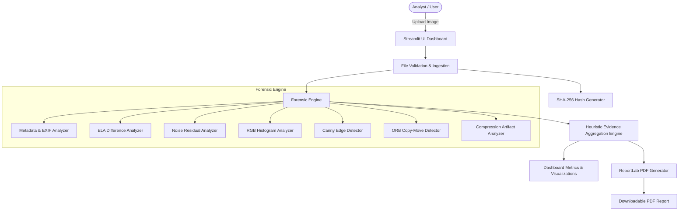
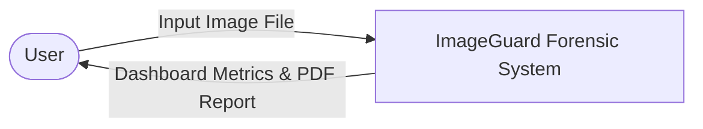
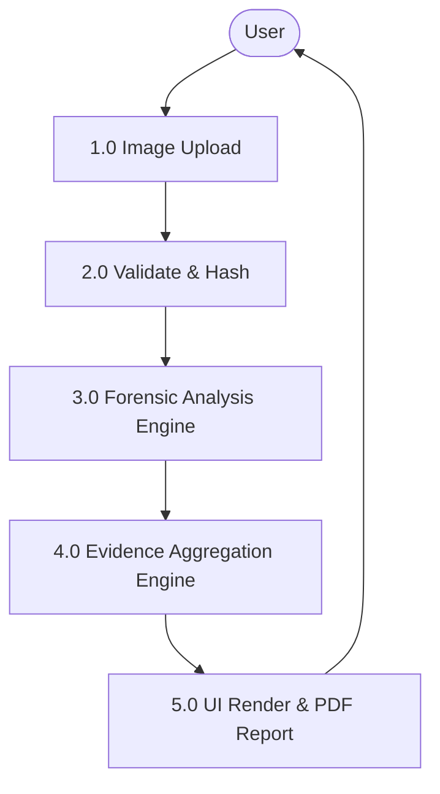

# IMAGEGUARD: DIGITAL IMAGE FORENSICS AND TAMPERING ANALYSIS TOOL
## Official College Mini Project Academic Documentation & Technical Report

---

### 1. ABSTRACT
Digital image integrity has become a paramount concern due to the proliferation of powerful image editing software and synthetic media generation tools. This project presents **ImageGuard**, an end-to-end digital image forensics workstation designed to perform multi-layered, non-destructive analysis on digital images. Built using Python, OpenCV, Streamlit, and ReportLab, ImageGuard extracts technical metadata, evaluates JPEG Error Level Analysis (ELA), measures high-frequency noise variance across spatial quadrants, detects intra-image copy-move (cloning) forgeries using ORB feature matching and RANSAC geometric verification, inspects JPEG quantization blockiness, and analyzes channel intensity histograms. Quantitative findings are consolidated into an Analysis Indicator Level (`LOW`, `MODERATE`, `HIGH`) via a transparent heuristic rule engine. The system generates publication-quality PDF reports without requiring deep-learning GPU infrastructure.

---

### 2. INTRODUCTION
In digital forensics, establishing image authenticity requires multi-faceted analysis. While casual tampering may alter visual aesthetics, it invariably disrupts underlying pixel statistics, compression histories, and metadata structures. ImageGuard addresses the need for a practical, explainable, locally runnable forensic dashboard that aggregates passive forensic techniques into an intuitive user workstation.

---

### 3. BACKGROUND & LITERATURE REVIEW
Digital image forensics relies on passive (blind) authentication algorithms. Passive techniques operate without embedded digital watermarks or signatures. Key passive techniques include:
1. **EXIF Header Analysis**: Inspecting file creation parameters and editing software tags.
2. **Error Level Analysis (ELA)**: Introduced by Neal Krawetz, ELA evaluates the residual difference when an image is re-saved at a known JPEG quality factor.
3. **Noise Residual Analysis**: Measuring inconsistencies in high-frequency camera sensor noise profiles.
4. **Copy-Move Forgery Detection (CMFD)**: Identifying duplicated keypoints using local feature descriptors (e.g. SIFT, SURF, ORB).

---

### 4. PROBLEM STATEMENT
Existing commercial forensic tools are often proprietary, computationally heavy, or prohibitively expensive for academic and lightweight investigative use. Conversely, simple open-source scripts lack unified interfaces, reporting engines, and evidence aggregation logic. There is a need for a modular, transparent tool that presents multi-technique forensic evidence with proper scientific caveats.

---

### 5. EXISTING SYSTEM vs. PROPOSED SYSTEM

#### Limitations of Existing Systems:
- Heavy reliance on black-box deep learning models requiring high-end GPUs.
- Lack of transparent indicator scoring models.
- Binary "Real vs. Fake" outputs that lead to false positive misinterpretations.

#### Advantages of Proposed System (ImageGuard):
- Works on standard laptop CPU hardware without GPU requirements.
- Uses explainable computer vision algorithms (ORB, ELA, Canny, Gaussian residual).
- Provides downloadable ReportLab PDF reports.
- Enforces academic disclaimers and heuristic indicator levels.

---

### 6. PROJECT OBJECTIVES
1. Develop an interactive Streamlit workstation for file ingestion and visualization.
2. Calculate cryptographic SHA-256 and MD5 hashes for chain-of-custody tracking.
3. Extract EXIF metadata and flag editing software tags.
4. Implement Error Level Analysis with user-controlled JPEG quality settings.
5. Compute spatial noise variance across image quadrants.
6. Perform ORB keypoint descriptor matching for copy-move detection with RANSAC verification.
7. Evaluate 8x8 DCT grid blockiness metrics.
8. Aggregate findings into an evidence score and generate downloadable PDF reports.

---

### 7. SYSTEM ARCHITECTURE & DATA FLOW DIAGRAMS

#### System Architecture Diagram (Mermaid Source):

#### Level 0 DFD:

#### Level 1 DFD:

---

### 8. ALGORITHM FORMULATIONS

#### 8.1 SHA-256 Hashing
$$H = \text{SHA-256}(B_{\text{raw}})$$

#### 8.2 Error Level Analysis (ELA)
$$D(x,y) = |I(x,y) - I_{\text{recompressed}}(x,y)|$$
$$E(x,y) = \min(255, \, \alpha \cdot D(x,y))$$

#### 8.3 Noise Residual Map
$$N(x,y) = |I_{\text{gray}}(x,y) - \text{GaussianBlur}(I_{\text{gray}}, k, \sigma)|$$

#### 8.4 Copy-Move ORB Feature Matching
1. Keypoint & Descriptor Extraction: $K, D = \text{ORB}(I_{\text{gray}})$
2. Lowe's Ratio Test: $m.\text{distance} < 0.75 \times n.\text{distance}$
3. Spatial Filter: $d(p_1, p_2) \ge \tau_{\text{spatial}}$
4. Geometric Affine Verification via RANSAC.

---

### 9. SYSTEM REQUIREMENTS

#### Hardware Requirements:
- **Processor**: Intel Core i3 / AMD Ryzen 3 or higher.
- **RAM**: 4 GB minimum (8 GB recommended).
- **Storage**: 500 MB available disk space.

#### Software Requirements:
- **Operating System**: Windows 10 / 11 (or Linux / macOS).
- **Language Environment**: Python 3.11+.
- **Primary Packages**: Streamlit, OpenCV, Pillow, NumPy, Matplotlib, Plotly, ReportLab, pytest.

---

### 10. CONCLUSION & FUTURE SCOPE
ImageGuard demonstrates that multi-technique passive forensic tools can be effectively implemented in Python for practical desktop deployment. Future developments include integrating frequency-domain Discrete Cosine Transform (DCT) block matching, PRNU (Photo-Response Non-Uniformity) camera sensor fingerprinting, and lightweight neural network classifiers.
